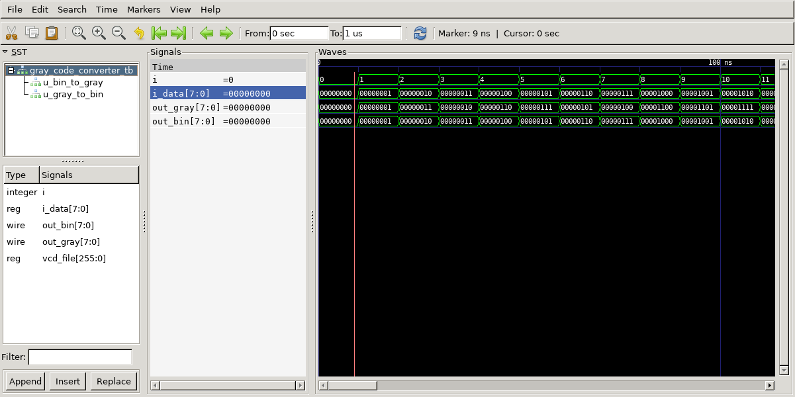

# Gray Code Converter
## Operation Principle
- Consecutive numbers differ in only one bit position.
- Bin -> Gray
	- G[N-1]	= B[N-1]
	- G[i]		= B[i+1] ^ B[i]

## Verilog Code
### DUT
```veilog 

```

### Tesetbench
```verilog	

```

## Simulation Result
- @ 10ns
	- 010	--> 010


