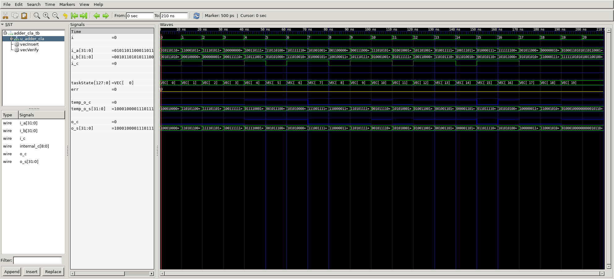

# 32-bit Carry-Lookahead Adder
## Operation Principle
- Column i produces a carry out by either.
- Generate(G[i]) and Propagate(P[i]) signals for each column.
	- Generate carry out if A[i] AND B[i] both 1.
	- G[i] = A[i] & B[i]
	- Propagate carry out if A[i] OR B[i] is 1.
	- P[i] = A[i] ^ B[i]
	- So, Carry out of column i is
	- C[i] = A[i]&B[i] | (A[i]^B[i])&C[i-1] = G[i] + P[i]&C[i-1]

## Step by Step 
- Step 1: Compute G[i] and P[i] for all colums(Bitwise)
	- P = A ^ B
	- G = A & B
- Step 2: Compute G and P for k-bit blocks(Group)
	- GroupP = &P 
	- GroupG = G[i:k] + P[i:k]&G[k-1:j]
- Step 3: Cin Propagate through each k-bit Propagate/Generate blocks
	- C[i] = GroupG + GroupP&Cin

## Verilog Code
### DUT
```verilog	

module	cla_block_4bit
(
	output					o_c,
	output		[3:0]		o_s,
	input		[3:0]		i_a,
	input		[3:0]		i_b,
	input					i_c
);
	wire		dummy_c;
	assign		{dummy_c, o_s}	= i_a + i_b + i_c;
	
	// Bitwise Propagation & Generation
	wire		[3:0]		p;
	wire		[3:0]		g;
	assign		p	= i_a ^ i_b;
	assign		g	= i_a & i_b;

	// Group Propagation & Generation
	wire		group_p;
	wire		group_g;
	assign		group_p		= &p;	// p[3]&p[2]&p[1]&p[0]
	assign		group_g		= g[3] | (p[3] & (
											g[2] | (p[2] & (
											g[1] | (p[1] & (
											g[0]))))));

	assign		o_c			= group_g | (group_p & i_c);
endmodule


module adder_cla
(
	output						o_c,
	output		[31:0]			o_s,
	input		[31:0]			i_a,
	input		[31:0]			i_b,
	input						i_c
);
	
	wire		[8:0]			internal_c;

	assign		internal_c[0]	= i_c;
	assign		o_c				= internal_c[8];

	genvar		i;
	generate
		for (i=0; i<8; i=i+1) begin
			cla_block_4bit
			u_cla_block_4bit(
				.o_c			(internal_c[i+1]	),
				.o_s			(o_s[4*(i+1)-1-:4]	),
				.i_a			(i_a[4*(i+1)-1-:4]	),
				.i_b			(i_b[4*(i+1)-1-:4]	),
				.i_c			(internal_c[i]		)
			);
		end
	endgenerate

endmodule
```

### Testbench
```verilog	
```

## Simulaiton Result
- err = 0
	- Expected output and Real output is Same


