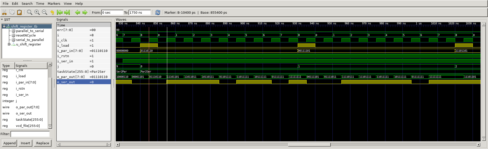

# 8-bit Shift Register
## Operation Principle
- Shift Register with Parallel Load
	- When Load=1, acts as a normal N-bit Register
	- When Load=0, acts as a shift Register
	- First Cycle-> Load=1, other Cycle-> Load=0
- Serial-in to Parallel-out ( Load=0 )
	- Serial-to-Parallel converter(S -> Q[0:N-1])
	- Shift a new bit in on each clock edge
	- Shift a bit out    on each clock edge
- Parallel-in to Serial-out

## Verilog Code
### DUT
```verilog	
```

### Testbench
```verilog	
```

## Simulation Result
- Serial to Parallel (Load=0)
	- every posedge of clock, Shift new bit


- Parallel to Serial (Load=1)

