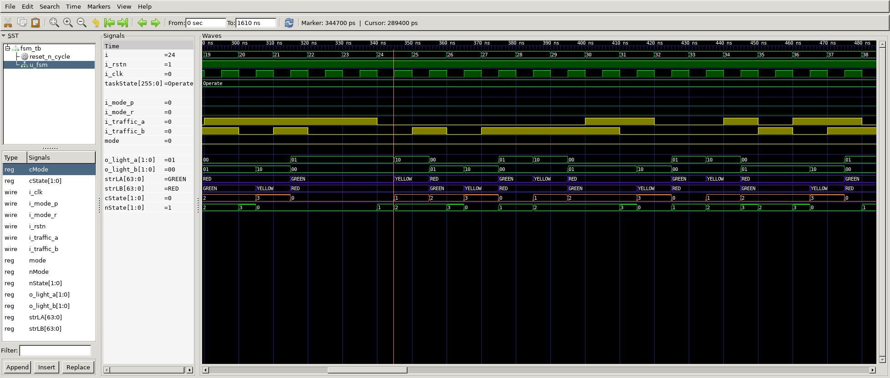

# FSM: Traffic Light Controller
## Operation Principle
- Factoring State Machines
- Break complex FSMs into smaller interacting FSMs
- Modify traffic light controller to have Parade Mode
	- Two more inputs: P, R
	- When P=1, enter Parade Mode & Bravado Blvd light stays green
	- When R=1, leave Parade Mode

## Logic
- Set parameter
	- output is light a and light b & set color parameter
	- set state parameter for Light FSM: S0~S3
	- set mode state parameter for Mode FSM: MS0, MS1
- Main State Register
	- declare cState and nState
- Sub State Register
	- declare nMode and cMode
- Next State Logic
	- Lights FSM-> define NextState by input traffic and mode
- Next Mode Logic
	- Mode FSM-> define NextMode by input modes.
- Output Logic
	- Output Light: define each color of ligth a,b by cState.
	- Output Mode :	define 'mode' by cMode parameter.

## Verilog Code
### DUT
```veilog	
```

### Testbench
```verilog	
```

## Simulation Result
- Look current state and input signals for Output.

